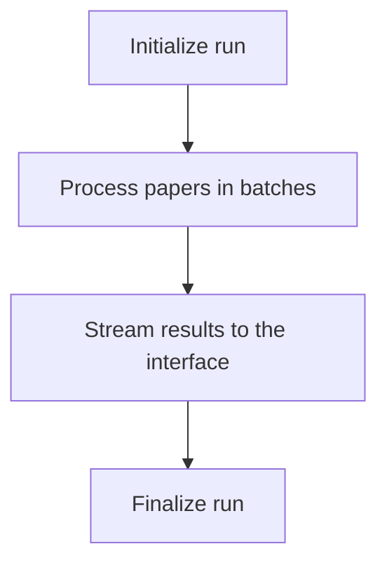

## What is Title & Abstract Screening?

Title & Abstract Screening is the first screening stage in your systematic review. Every paper in your pool is evaluated against the inclusion and exclusion criteria in your protocol using the paper's title and abstract.

The system produces one decision for each paper: **Include**, **Exclude**, or **Maybe**. It also shows criterion-level verdicts and cited evidence from the abstract so you can see why the paper was classified that way.

This stage is intentionally sensitive. It removes clearly irrelevant papers while preserving borderline papers for closer review in the next stage. Papers marked **Included** or **Maybe** move forward to Full Text Screening.

## Screening modes

The screening mode is set when you create the review and cannot be changed later.

<Tabs>
  <Tab title="AI-led" icon="zap">

  The AI screens each paper first, and you verify or change the result.

  - **Who screens:** the AI
  - **Human action:** confirm the AI decision or override it
  - **How you record decisions:** confirm the recommendation or change the final outcome
  - **Best for:** faster reviews with human verification

  </Tab>
  <Tab title="Dual-reviewer" icon="users">

  Two independent reviewers screen each paper separately. If they disagree, a conflict resolver makes the final decision.

  - **Who screens:** two independent reviewers, which may be human or AI depending on the review setup
  - **Human action:** each reviewer submits a decision independently
  - **How disagreements work:** conflicting decisions move to conflict resolution
  - **Best for:** review methods that require independent agreement

  </Tab>
</Tabs>

<Callout kind="info">

In AI-led mode, the screening flow is AI decision first, then human verification. In dual-reviewer mode, reviewers submit independent decisions and the system tracks disagreement resolution separately.

</Callout>

## Interface layout

The screening workspace uses a master-detail layout so you can move quickly through large paper sets without losing context.

- **Paper list** on the left shows papers in the screening pool and their current status.
- **Detail panel** on the right shows the selected paper's title, abstract, current decision, criterion verdicts, and supporting evidence.
- **Tabs, filters, and sorting** help you focus on papers that still need attention.

This layout is designed for high-volume review work. You can scan the queue, select a paper, review the reasoning, and confirm or override the decision without leaving the page.

## Decision tabs

Papers are organised into four tabs so you can review by outcome.

- **All** shows every paper in the Title & Abstract screening pool.
- **Included** shows papers selected to move forward.
- **Excluded** shows papers filtered out at this stage.
- **Maybe** shows papers where the evidence is unclear or incomplete.

The **Maybe** tab is especially useful when you want to concentrate on edge cases. It collects the papers most likely to need closer human judgment.

## How AI decisions are made

For each paper, the system evaluates every screening criterion and then derives one overall decision from the criterion-level results.

- **Overall decision**: Include, Exclude, or Maybe
- **Criterion verdicts**: Yes, No, or Maybe for each criterion
- **Cited evidence**: supporting text pulled from the abstract for each verdict

The decision logic is conservative by design:

- If **any** criterion is **No**, the paper is **Excluded**
- If **all** criteria are **Yes**, the paper is **Included**
- If none are **No** and at least one criterion is **Maybe**, the paper is **Maybe**

<Callout kind="tip">

Read criterion verdicts before changing the overall decision. In most cases, a disagreement with the final recommendation comes from one criterion that needs a different judgment.

</Callout>

## Verify or override a decision

In AI-led mode, the AI recommendation is not the same as a verified final decision. You review the paper, inspect the criterion verdicts and evidence, then either confirm the result or change it.

<Steps>
  <Step title="Open a paper that needs review" icon="book-open">

  Select a paper from **All**, **Included**, **Excluded**, or **Maybe**. Start with unconfirmed papers if you want to clear the queue efficiently.

  Success looks like this: the detail panel updates with the paper's title, abstract, current decision, and criterion-level reasoning.

  </Step>
  <Step title="Review the criterion verdicts and evidence" icon="search">

  Check each inclusion and exclusion criterion against the abstract evidence shown in the detail panel. Focus on any criterion marked **No** or **Maybe**, because those drive most disputed outcomes.

  If the abstract does not support a clean decision, keep the paper as **Maybe** so it can receive closer review later.

  </Step>
  <Step title="Confirm or change the decision" icon="check-circle">

  If you agree with the recommendation, confirm it. If you disagree, override the decision to **Include**, **Exclude**, or **Maybe**.

  Success looks like this: the paper status updates in the list, and the decision is recorded as reviewed rather than only AI-generated.

  </Step>
</Steps>

## Verification system

Verification creates a clear distinction between what the AI recommended and what you accepted as the final decision.

- **AI decision** is the system's recommended outcome.
- **Confirmed decision** is the outcome you reviewed and accepted.
- **Override** means you changed the AI recommendation to a different final decision.

You can verify papers one at a time or use bulk confirmation for batches you have already reviewed. Confirmed decisions stay fixed until you explicitly reverse that confirmation.

<Callout kind="info">

Verification creates an auditable trail of AI-made and human-verified decisions. That record helps you report your screening process transparently.

</Callout>

## Dual-reviewer conflicts

In dual-reviewer mode, each reviewer submits an independent decision. The system then compares the two outcomes and tracks the result through a conflict status.

The workflow follows four states:

| Status | What it means |
|---|---|
| **pending** | One or both reviewers have not finished yet |
| **decided** | The paper has a decision without conflict |
| **conflict** | Reviewers submitted different decisions |
| **resolved** | A conflict resolver settled the disagreement |

When a paper enters **conflict**, a resolver reviews both decisions and records the final outcome. That keeps independent screening separate from adjudication.

## Screening progress

Screening runs in the background and update in real time while papers are processed. You do not need to wait for the full run to finish before you start reviewing results.

The run follows a staged workflow:

Papers are processed in batches of five. Results stream into the interface through Server-Sent Events, so the paper list updates as decisions become available.

Success looks like this: the progress banner advances while papers begin appearing in the decision tabs before the run completes.

## Filters and sorting

Use filters and sorting to focus on the papers that need action first.

- **Filter by decision** to review only Included, Excluded, or Maybe papers.
- **Filter by verification status** to find papers that still need confirmation.
- **Sort the list** to work by title, year, citations, or decision date.

A common workflow is to sort by decision date and then filter to unconfirmed papers. That gives you a clean review queue during active screening runs.

## When screening runs again

The system can trigger screening more than once when the review changes after the initial run.

<ExpandableGroup>
  <Expandable title="Initial screening run" default-open="true">

  The first run starts when Title & Abstract Screening begins for the current paper pool.

  This run evaluates all eligible papers against the current protocol criteria.

  </Expandable>
  <Expandable title="Protocol changes">

  If you update the screening criteria in the protocol, the system can trigger a new run. The trigger type for this case is `PROTOCOL_UPDATE`.

  Depending on what changed, the system may require a broader re-screen to keep decisions consistent with the updated criteria.

  </Expandable>
  <Expandable title="Paper updates or new papers">

  If papers are added or changed after a run, the system can trigger screening again with the `PAPER_UPDATE` trigger.

  This is typically used to screen newly added records without restarting unrelated completed work.

  </Expandable>
</ExpandableGroup>

The system also distinguishes the initial run itself with the `INITIAL` trigger type. When criteria changes affect downstream work, later stages such as Full Text Screening or Data Extraction may also need attention.

## What moves to the next stage

Title & Abstract Screening decides which papers stay in scope for deeper review.

- **Included** papers move forward to Full Text Screening.
- **Maybe** papers also move forward so you can make a better decision with the full paper.
- **Excluded** papers stop at this stage unless you later rescreen them.

This design favors recall over premature exclusion. If the abstract leaves real uncertainty, keep the paper in the review.

## Next steps

<Columns cols={3}>
  <Card title="Systematic Review Overview" href="/systematic-review/overview" icon="book-open" />
  <Card title="Full Text Screening" href="/systematic-review/full-text-screening" icon="arrow-right" />
  <Card title="Papers" href="/systematic-review/papers" icon="folder" />
</Columns>